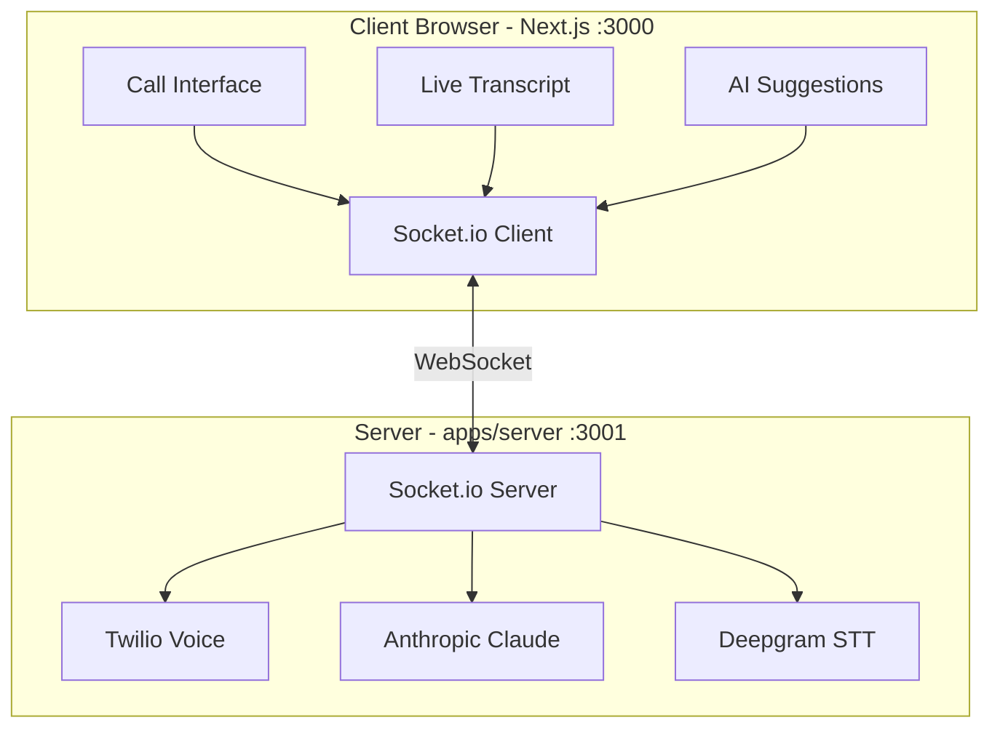

<div align="center">

# Wholesale AI

### Real-Time AI Negotiation Copilot for Real Estate Wholesalers

[](https://nextjs.org/)
[](https://react.dev/)
[](https://www.typescriptlang.org/)
[](https://socket.io/)
[](https://turbo.build/)
[](https://pnpm.io/)
[](https://opensource.org/licenses/MIT)

[Features](#-features) • [Quick Start](#-quick-start) • [Architecture](#-architecture) • [API Reference](#-api-reference)

</div>

---

## Overview

Wholesale AI is a real-time AI-powered negotiation assistant that helps real estate wholesalers analyze seller conversations, detect objections, track motivation levels, and receive strategic response suggestions—all in real-time.

## 🏗️ Project Structure

```
wholesale-ai/
├── apps/
│   ├── web/                 # Next.js 16 frontend (port 3000)
│   │   └── src/
│   │       ├── app/         # App Router pages
│   │       ├── components/  # React components + shadcn/ui
│   │       └── hooks/       # Custom hooks (Socket, Twilio, Mic)
│   └── server/              # Socket.io server (port 3001)
│       └── src/lib/         # AI analysis, Twilio, transcription
├── packages/
│   ├── shared/              # Shared types and utilities
│   └── typescript-config/   # Shared TypeScript configs
└── scripts/                 # Dev tunnel and utilities
```

## ✨ Features

| Feature | Description |
|---------|-------------|
| **Real-time Transcription** | Live speech-to-text with Deepgram and speaker identification |
| **AI Analysis Engine** | Claude-powered conversation analysis and strategic insights |
| **Motivation Scoring** | Real-time seller motivation tracking (1-10 scale) |
| **Objection Detection** | Automatic identification and classification of objections |
| **Strategic Suggestions** | AI-generated response recommendations |
| **Twilio Integration** | Make and receive real phone calls |
| **Demo Mode** | Simulated conversations for testing and training |

## 🛠️ Tech Stack

| Layer | Technologies |
|-------|-------------|
| **Frontend** | Next.js 16, React 19, Tailwind CSS, shadcn/ui, Socket.io Client |
| **Backend** | Node.js, Socket.io, TypeScript, Zod |
| **AI/ML** | Anthropic Claude, Deepgram STT |
| **Telephony** | Twilio Voice SDK |
| **Build** | Turborepo, pnpm workspaces, Biome |
| **Deploy** | Railway |

## 🚀 Quick Start

### Prerequisites

- Node.js 18+
- pnpm 9+

### Installation

```bash
# Clone the repository
git clone https://github.com/ProductOfAmerica/wholesale-ai.git
cd wholesale-ai

# Install dependencies
pnpm install

# Set up environment variables
cp .env.example .env.local
```

### Environment Variables

```bash
# Required
ANTHROPIC_API_KEY=your-anthropic-key
DEEPGRAM_API_KEY=your-deepgram-key

# Optional (for Twilio calls)
TWILIO_ACCOUNT_SID=your-twilio-sid
TWILIO_AUTH_TOKEN=your-twilio-token

# Server
FRONTEND_URL=http://localhost:3000
```

### Development

```bash
# Start all apps (with Cloudflare tunnel for Twilio webhooks)
pnpm dev

# Or start individually
pnpm dev:web     # Next.js on :3000
pnpm dev:server  # Socket.io on :3001
```

### Commands

| Command | Description |
|---------|-------------|
| `pnpm dev` | Start all dev servers with tunnel |
| `pnpm build` | Build all packages |
| `pnpm test` | Run tests across all packages |
| `pnpm typecheck` | Type check all packages |
| `pnpm lint` | Lint with Biome |
| `pnpm lint:fix` | Auto-fix lint issues |
| `pnpm clean` | Clean all build outputs |

## 🏛️ Architecture



## 📡 API Reference

### Socket.io Events

#### Client → Server

| Event | Payload | Description |
|-------|---------|-------------|
| `start_call` | `{ phoneNumber }` | Initialize new call |
| `simulate_speech` | `{ speaker, text }` | Send simulated text |
| `run_demo` | - | Start demo conversation |
| `end_call` | - | End current call |

#### Server → Client

| Event | Payload | Description |
|-------|---------|-------------|
| `transcript_update` | `{ speaker, text, timestamp }` | New transcript segment |
| `ai_suggestion` | `{ motivation_level, pain_points, objection_detected, suggested_response, recommended_next_move }` | AI analysis result |
| `call_status` | `{ status, callSid }` | Call state updates |

### AI Response Schema

```typescript
interface AISuggestion {
  motivation_level: number;      // 1-10 scale
  pain_points: string[];         // Identified concerns
  objection_detected: boolean;
  objection_type?: string;       // price, timeline, trust, etc.
  suggested_response: string;    // < 200 characters
  recommended_next_move: string;
}
```

## 🧪 Testing

```bash
# Run all tests
pnpm test

# Run with watch mode
pnpm test -- --watch
```

- **Framework**: Vitest
- **Approach**: TDD with mocked external APIs
- **Coverage**: AI analysis, transcription, type validation

## 🚢 Deployment

### Railway

1. Connect GitHub repository to Railway
2. Set environment variables in Railway dashboard
3. Deploy automatically on push to `master`

## 📝 License

MIT License - Built for real estate wholesale professionals.

---

<div align="center">

**[⬆ Back to Top](#wholesale-ai)**

</div>
